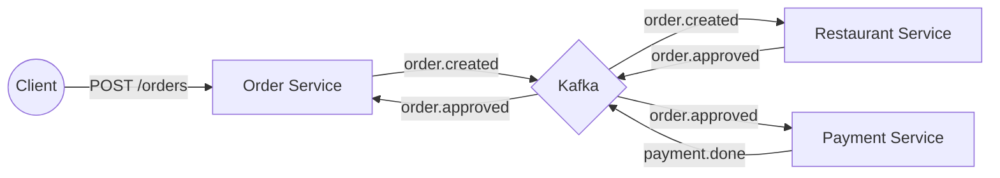

# Microservices Order & Payment System

[]()
[]()
[]()

A demonstration of an Event-Driven Microservices architecture using Spring Boot, Kafka, and PostgreSQL. This system handles the complete lifecycle of an order from creation to approval and payment processing.

## 🏗 Architecture

The system consists of three decoupled services communicating asynchronously via Kafka:

| Service | Port | Responsibility |
|---------|------|----------------|
| **Order Service** | `8081` | Manages order lifecycle (Create -> Pending -> Approved). |
| **Restaurant Service** | `8083` | Validates and auto-approves orders. |
| **Payment Service** | `8082` | Processes payments for approved orders. |

### Event Flow
1. **Order Created**: `Order Service` publishes `order.created`.
2. **Approval**: `Restaurant Service` consumes `order.created` → publishes `order.approved`.
3. **Status Update**: `Order Service` consumes `order.approved` → updates status to `APPROVED`.
4. **Payment**: `Payment Service` consumes `order.approved` → processes payment → publishes `payment.done`.



## 🚀 Getting Started

### Prerequisites
- **Docker Desktop** (with Docker Compose)
- **Java 21** (optional, for local dev)

### Quick Start
1. **Clone the repository**

2. **Start the stack**
   ```bash
   docker-compose up --build -d
   ```

3. **Verify services**
   ```bash
   docker-compose ps
   ```

## 🧪 Usage & Testing

### 1. Create an Order
```bash
curl -X POST http://localhost:8081/api/orders \
  -H "Content-Type: application/json" \
  -d '{"customerId":"cust-001","totalAmount":150.00,"paymentMethod":"CREDIT_CARD"}'
```

### 2. Check Order Status
Wait a few seconds for the event loop to complete, then check the status (should be `APPROVED`):
```bash
curl http://localhost:8081/api/orders/1
```

### 3. View Approval History
```bash
curl http://localhost:8083/api/approvals
```

## 🛠 Development

### Project Structure
```
.
├── docker-compose.yml   # Orchestration for Services, Kafka, Zookeeper, Postgres
├── order-service/       # Spring Boot App (Port 8081)
├── restaurant-service/  # Spring Boot App (Port 8083)
└── payment-service/     # Spring Boot App (Port 8082)
```

### Useful Commands
- **View Logs**: `docker-compose logs -f [service-name]`
- **Stop Stack**: `docker-compose down`
- **Reset Data**: `docker-compose down -v`

## 📝 License
This project is licensed under the MIT License.
